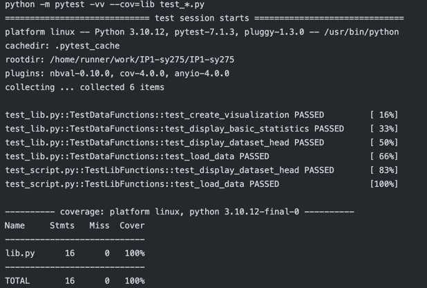

# Project #1: Continuous Integration using GitHub Actions of Python Data Science Project

## Goal

> Duke University IDS 706 Individual Project 1

The project structure must include the following files:
-  Jupyter Notebook with: 
  - Cells that perform descriptive statistics using Polars or Panda.
  - Tested by using nbval plugin for pytest
- Python Script performing the same descriptive statistics using Polars or Panda
- lib.py file that shares the common code between the script and notebook
- Makefile with the following: 
  - Run all tests (must test notebook and script and lib)
  - Formats code with Python black
  - Lints code with Ruff
  - Installs code via: pip install -r requirements.txt
- test_script.py to test script
- test_lib.py to test library
- Pinned requirements.txt
- GitHub Actions performs all four Makefile commands with badges for each one in
the README.md

## Preparation

1. make sure a data.csv file is in the same directory as main.py
2. Python 3 or above
3. Pandas
4. matplotlib.pyplot 
5. The dataset file is as follow:

## Explanation
1. jupyter notebook: `Project1.ipynb` perform descriptive statistics using Pandas
2. python script: `main.py` which is same as the main.py in my mini project 2
3. lib file: `lib.py` which share the common code betwwen the python script and jupyter notebook
4. makefile : `Makefile` which performs
   - `make test` : run all tests including notebook, script and lib
   - `make format` : format the code using black
   - `make lint` : lint the code using Ruff
   - `make install` : install the required packages
5. `test_script.py` : test the script
6. `test_lib.py` : test the lib
7. `requirements.txt` : pinned requirements
8. `README.md` : badges for each makefile command

## Result and Test

### Result

To show correctly reading the dataset, I use the head() function to display the first

Further, I display the statistics of the dataset with median added:

The data visualization, the histogram of the `Salary` of the dataset:

## Test
Test for python script:

## Reference

1.  https://github.com/nogibjj/python-template

## Youtube Video Link

//TODO add youtube link here

